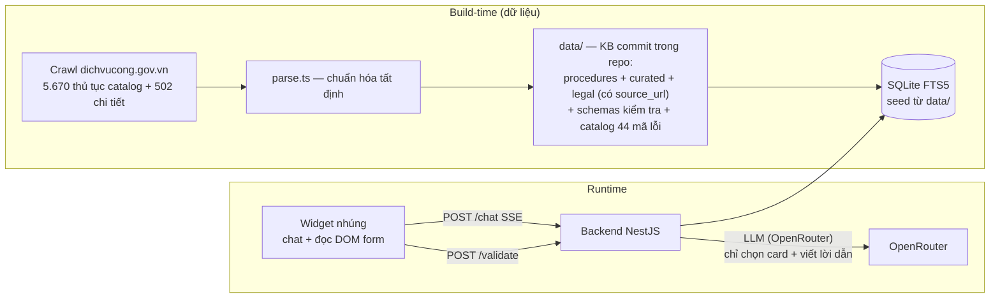

# OpenGOV — Trợ lý AI nhúng vào cổng dịch vụ công

OpenGOV là trợ lý AI **nhúng thẳng vào cổng dịch vụ công hiện có** (qua widget/API, không cần cài app mới), giúp người dân nộp hồ sơ hành chính **đúng và đủ ngay lần đầu**: hướng dẫn theo tình huống cụ thể, trả lời có trích dẫn pháp lý, và **kiểm tra hồ sơ trước khi nộp** bằng luật kiểm tra máy-đọc-được thay vì để cán bộ trả hồ sơ về sửa.

Đề bài và tiêu chí đánh giá gốc: [PROBLEM.md](PROBLEM.md). Tổng quan ba trụ cột giải pháp (dữ liệu · widget chatbot · overlay sâu): [SOLUTION.md](SOLUTION.md). Trạng thái và việc còn lại: [PLAN.md](PLAN.md).

## Vấn đề

Người dân làm thủ tục hành chính (đăng ký thường trú, thành lập doanh nghiệp, nội quy lao động…) gặp 3 rào cản: **không biết chuẩn bị gì** (giấy tờ nào, mẫu nào, nộp đâu); **không biết mình điền đúng chưa** — sai sót chỉ lộ ra khi cán bộ xét hồ sơ; **hỏi đáp tắc nghẽn** nên phải đi lại nhiều lần. Chi tiết trong [PROBLEM.md](PROBLEM.md).

## Giải pháp & điểm khác biệt

1. **Kiểm tra trước khi nộp là lõi, không phải hỏi–đáp chung chung.** Hỏi–đáp thì Google/chatbot nào cũng làm được; cái người dân thiếu là được báo lỗi *trước* khi nộp. OpenGOV cấu trúc từng thủ tục thành **schema kiểm tra máy-đọc-được** (trường bắt buộc theo tình huống, định dạng, ràng buộc chéo, giấy tờ điều kiện) — việc kiểm tra là **tất định, kiểm chứng được, không ảo giác**.
2. **Tri thức có cấu trúc + trích dẫn nguồn, không phải RAG thuần trên văn bản luật.** Mỗi thủ tục là một bản ghi chuẩn hóa từ dichvucong.gov.vn, kèm **trích đoạn pháp lý có `source_url`**; số liệu (phí, thời hạn, cơ quan) render thẳng từ CSDL vào card — **không đi qua LLM** nên không thể bịa số.
3. **Embed-first ngay từ thiết kế.** Một thẻ `<script>` là cổng có trợ lý (Pha 1); tích hợp sâu bằng API + web components (Pha 2). Phần demo dùng bản clone cổng DVC được dựng **độc lập, không biết gì về widget** — để chứng minh chi phí tích hợp thật.

## Kiến trúc tổng quan



Nguyên tắc xuyên suốt: cấu trúc hóa **offline có người duyệt**, runtime không diễn giải văn bản thô; chat **fail-closed** (ngoài dữ liệu → nói rõ "không có trong dữ liệu" + link cổng chính thức); thêm thủ tục mới = **thêm dữ liệu, không thêm code**. Chi tiết: [docs/DESIGN.md](docs/DESIGN.md) (giải pháp, use case, quyết định thiết kế) và [docs/ARCHITECTURE.md](docs/ARCHITECTURE.md) (kiến trúc backend).

## 3 thủ tục pilot

Phạm vi pilot là lựa chọn có chủ đích để demo sâu, không phải giới hạn năng lực — kiến trúc mở rộng bằng dữ liệu.

| Mã | Thủ tục | Điểm demo kiểm tra hồ sơ |
|---|---|---|
| 1.004222 | Đăng ký thường trú | Checklist thay đổi theo 6 trường hợp (về với người thân, thuê/mượn/ở nhờ…); thiếu ý kiến chủ sở hữu chỗ ở; số định danh 12 chữ số |
| 2.001610 | Đăng ký thành lập doanh nghiệp tư nhân | Tên doanh nghiệp vi phạm Điều 38 Luật DN (kiểm tra ngữ nghĩa); vốn bằng chữ lệch bằng số; mã ngành cấp 4; vốn góp vượt tổng vốn |
| 2.001955 | Đăng ký nội quy lao động | Dưới 10 lao động → không bắt buộc đăng ký (Điều 119 BLLĐ); địa chỉ dùng tỉnh đã sáp nhập hoặc cấp huyện đã bỏ (cải cách 01/07/2025, 34 tỉnh, chính quyền 2 cấp) |

## Đáp ứng tiêu chí đánh giá

| Tiêu chí ([PROBLEM.md](PROBLEM.md)) | Cách giải quyết | Bằng chứng trong repo |
|---|---|---|
| Chính xác & đầy đủ so với quy định hiện hành | KB chuẩn hóa từ nguồn công khai; mọi trích đoạn pháp lý bắt buộc `source_url` + ngày lấy; số liệu từ CSDL qua card, không qua LLM; ngoài phạm vi → fail-closed | `data/legal/*.json`, `data/curated/*.json` (khối `review`), `data/golden-qa.json` (30 câu chuẩn), cập nhật sáp nhập tỉnh 2025 trong `data/provinces.json` |
| Phát hiện lỗi & thiếu sót trong hồ sơ | Rule engine tất định (10 loại rule đóng: bắt buộc theo tình huống, định dạng, ngày, khoảng số, tỉnh sáp nhập, cấp huyện, ràng buộc chéo…) + kiểm tra ngữ nghĩa bằng LLM đã che PII; 44 mã lỗi có thông điệp + gợi ý sửa tiếng Việt | `data/schemas/*.form.json`, `data/errors/catalog.json`, `backend/src/validation/` + bộ unit test `backend/test/` |
| Khả thi tích hợp + lộ trình pilot | Embed-first: Pha 1 một thẻ script, Pha 2 API + web components; bản clone cổng DVC dựng độc lập rồi mới tích hợp — lịch sử git là bằng chứng chi phí tích hợp | `dichvucong/` (clone tự chứa, không tham chiếu widget), [docs/DESIGN.md](docs/DESIGN.md) §các pha tích hợp, [docs/WIDGET.md](docs/WIDGET.md) |
| Trải nghiệm cho người dân không rành công nghệ | Demo trên giao diện cổng DVC quen thuộc; hội thoại tiếng Việt tự nhiên + card sinh giao diện (checklist tick được, phí, thời hạn, trích dẫn); thông điệp lỗi nói rõ sửa thế nào | `dichvucong/` luồng nộp toàn trình 3 thủ tục, `data/errors/catalog.json` (message + suggestion) |

## Chạy local

```bash
pnpm install                            # workspace gốc (backend + tools)
pnpm --dir backend seed                 # dựng SQLite từ data/ → backend/var/opengov.db
pnpm --dir backend build && pnpm --dir backend start   # API: http://localhost:3001 (GET /health)
pnpm --dir backend test                 # unit tests engine/chat/search

# Cổng demo (workspace pnpm riêng, tự chứa):
cd dichvucong && pnpm install && pnpm dev              # http://localhost:3000
```

`OPENROUTER_API_KEY` (file `backend/.env`) là **tùy chọn**: thiếu key thì `/chat` trả lời degrade kèm link cổng chính thức và `/validate` bỏ bước kiểm tra ngữ nghĩa — toàn bộ rule tất định vẫn chạy đủ.

Trạng thái hiện tại: dữ liệu + backend + cổng demo chạy được như trên; widget nhúng và deploy backend public đang trong [PLAN.md](PLAN.md).

## Bản đồ repo

```
PROBLEM.md            # đề bài + tiêu chí gốc (bất biến)
SOLUTION.md           # tổng quan 3 trụ giải pháp: dữ liệu · widget chatbot · overlay sâu
PLAN.md               # trạng thái từng giai đoạn + việc còn lại
docs/DESIGN.md        # giải pháp, use case widget, quyết định thiết kế + trade-off
docs/ARCHITECTURE.md  # kiến trúc backend, đặc thù dữ liệu crawl
docs/DATA.md          # contract mọi artifact data/ + DDL (nguồn sự thật duy nhất)
docs/WIDGET.md        # spec widget nhúng (Pha 1 + Pha 2)
data/                 # KB: procedures (máy sinh) · curated/legal/schemas/errors (đã review)
backend/              # NestJS: POST /chat (SSE) · POST /validate · /sessions · /health
widget/               # bundle nhúng (đang phát triển theo docs/WIDGET.md)
dichvucong/           # clone cổng DVC làm môi trường demo (độc lập, có README riêng)
tools/                # crawler dichvucong.gov.vn + ETL parse
```

Đọc theo mục đích: hiểu bài toán → `PROBLEM.md`; hiểu giải pháp/thuyết trình → `SOLUTION.md` (tổng quan) rồi `docs/DESIGN.md` (chi tiết); làm backend/dữ liệu → `docs/DATA.md` + `docs/ARCHITECTURE.md` + `backend/CLAUDE.md`; làm widget → `docs/WIDGET.md`; xem tiến độ → `PLAN.md`.
