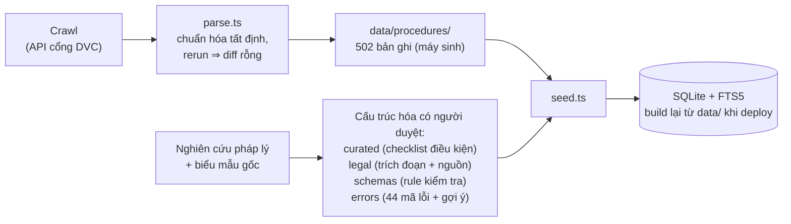

# SOLUTION.md — Giải pháp OpenGOV: ba trụ cột

> Tổng quan giải pháp ở mức cao nhất. Đề bài + tiêu chí: [PROBLEM.md](PROBLEM.md). Chi tiết use case + quyết định thiết kế: [docs/DESIGN.md](docs/DESIGN.md). Tiến độ: [PLAN.md](PLAN.md).

Mục tiêu sản phẩm: người dân nộp hồ sơ hành chính **đúng và đủ ngay lần đầu**, ngay trên cổng dịch vụ công họ đang dùng. Giải pháp gồm ba trụ cột xếp chồng — mỗi trụ đứng được một mình, trụ sau nâng trải nghiệm của trụ trước:

| Trụ cột | Người dân nhận được gì | Cổng phải làm gì | Trạng thái |
|---|---|---|---|
| **1. Dữ liệu thủ tục máy-đọc-được** | Câu trả lời và kết quả kiểm tra đúng quy định hiện hành, có trích dẫn | Không | Hoàn thành (502 thủ tục, 3 pilot mức đầy đủ) |
| **2. Widget chatbot nhúng** | Hỏi đáp, checklist theo tình huống, kiểm tra hồ sơ trước khi nộp — trong cửa sổ chat | Một thẻ `<script>` (~1 giờ) | Backend hoàn thành; widget đang build ([docs/WIDGET.md](docs/WIDGET.md)) |
| **3. Overlay sâu + thao tác giao diện hộ** | Lỗi hiện ngay trên form, được điền hộ, được dẫn từng bước trên giao diện | Web components + mapping field→schema (nhỏ, khai báo) | Đã build phạm vi demo (19/07): field-hint + check-button + prefill có xác nhận + spotlight — toggle "Phase 2 preview" trên clone ([docs/WIDGET.md](docs/WIDGET.md) §12) |

## 1. Giải pháp dữ liệu — nền móng của độ chính xác

AI trả lời đúng hay sai là do dữ liệu, không phải do model. Vì vậy trụ 1 chiếm phần lớn công sức: biến thủ tục hành chính từ văn bản mô tả thành **dữ liệu có cấu trúc, truy vết được nguồn, kiểm soát phiên bản bằng git**.

### Nguồn và cách thu

| Nguồn | Thu như thế nào | Ra artifact gì |
|---|---|---|
| Cổng DVC quốc gia (dichvucong.gov.vn) | Crawler tự viết (`tools/`) gọi API công khai của cổng: catalog **5.670 thủ tục** + chi tiết **502 thủ tục** + danh sách tỉnh; có retry, manifest ghi ngày thu | `backend/data/crawl/` (input thô, read-only) |
| Biểu mẫu hành chính theo lĩnh vực (tờ khai gốc: CT01 — TT 53/2025/TT-BCA, Giấy đề nghị ĐKDN — TT 68/2025/TT-BTC…) | Đối chiếu văn bản gốc bằng tay → rút danh sách trường `snake_case` cho từng tờ khai | Khóa field trong `data/schemas/` (đồng thời là contract tích hợp form) |
| Văn bản quy phạm pháp luật (Luật Cư trú, Luật DN, BLLĐ, nghị định/thông tư liên quan) | Nghiên cứu thủ công + đối chiếu web; **mỗi trích đoạn bắt buộc `source_url` + ngày lấy** | `data/legal/<mã>.json` — trích đoạn gắn vào từng thủ tục |
| Danh mục hành chính hiện hành sau cải cách 01/07/2025 | Crawl 34 tỉnh hiện hành + đối chiếu NQ 202/2025/QH15 lập bảng 29 tỉnh giải thể (kiểm chéo bằng script) | `data/provinces.json` — nguồn cho rule bắt địa chỉ lỗi thời |

### Pipeline

Hai đường ray với yêu cầu tin cậy khác nhau: **KB rộng** (toàn bộ catalog, phục vụ hỏi đáp — chấp nhận chưa hoàn hảo vì mọi câu trả lời kèm link nguồn) và **schema kiểm tra hẹp** (chỉ thủ tục pilot, soạn tay từ tờ khai gốc, duyệt từng điều kiện — vì kết quả kiểm tra phải đúng tuyệt đối).

Tính chất quan trọng: mọi chuyển đổi văn bản → cấu trúc xảy ra **offline, có người duyệt** (mỗi file mang khối `review`); toàn bộ KB nằm trong git nên từng điều kiện diff/review/rollback được; parser idempotent nên tái thu dữ liệu là chạy lại lệnh; **thêm thủ tục mới = thêm dữ liệu, không sửa code**. Contract chi tiết từng artifact: [docs/DATA.md](docs/DATA.md).

## 2. Giải pháp widget chatbot — tích hợp Pha 1

Một thẻ `<script>` biến cổng hiện có thành cổng có trợ lý. Widget là bong bóng chat (Shadow DOM, không đụng gì trang chủ nhà), phía sau là backend NestJS đọc SQLite ở trên.

Người dân làm được ba việc:

1. **Nêu nhu cầu bằng lời thường** ("tôi muốn chuyển hộ khẩu về nhà vợ") → hệ thống tìm đúng thủ tục (alias + FTS5 + rerank), hỏi làm rõ tình huống, ghi từng câu trả lời thành **case fact có cấu trúc** → checklist giấy tờ và các bước lọc theo đúng tình huống đó. Checklist là **thẻ giao diện tất định** render từ dữ liệu đã duyệt (kể cả số lượng bản chính/bản sao — không qua LLM), người dân **tick từng mục** để theo dõi chuẩn bị.
2. **Hỏi đáp có trích dẫn**: phí, thời hạn, cơ quan, căn cứ pháp lý render từ CSDL vào **card giao diện** — LLM chỉ chọn card và viết lời dẫn, không tự sinh con số; trích đoạn luật kèm nút mở nguồn. Ngoài phạm vi dữ liệu → nói thẳng "không có trong dữ liệu" + link cổng chính thức (fail-closed).
3. **Kiểm tra hồ sơ trước khi nộp**: bấm một nút, widget đọc DOM form đang điền → `POST /validate` → rule engine tất định (10 loại rule) + kiểm tra ngữ nghĩa bằng LLM trên dữ liệu **đã che PII** → danh sách lỗi tiếng Việt kèm gợi ý sửa, phân mức error/warning/info, hiển thị trong chat.

Phiên hội thoại sống qua điều hướng trang; thiếu LLM key hệ thống degrade có chủ đích (rule tất định vẫn chạy đủ). Spec buildable + contract API: [docs/WIDGET.md](docs/WIDGET.md); use case chi tiết: [docs/DESIGN.md](docs/DESIGN.md) §2.

## 3. Giải pháp overlay sâu + thao tác giao diện hộ người dùng — tích hợp Pha 2

Trụ 2 chỉ ra lỗi *trong chat* — người dân vẫn phải tự tìm đúng ô, tự sửa, tự mò điều hướng. Với người không rành công nghệ, đó vẫn là rào cản. Trụ 3 đưa trợ giúp **ra thẳng giao diện của cổng**, theo ba mức tăng dần:

**Mức 1 — Overlay chỉ dẫn (đọc, tự động).** Web components gắn vào trang form: `<opengov-field-hint>` hiện gợi ý điền và lỗi inline ngay cạnh field (kiểm tra khi rời ô), `<opengov-check-button>` đặt cạnh nút nộp của cổng chạy kiểm tra toàn form; khi chat nhắc tới một trường, field đó được highlight; bấm vào một lỗi → trang tự cuộn và focus đúng ô.

**Mức 2 — Điền hộ có xác nhận (ghi, cần người dùng duyệt).** Những gì người dân đã kể trong hội thoại (case facts: họ tên, số định danh, tình huống…) được đề xuất đổ ngược vào form: widget hiển thị **bản xem trước** các giá trị định điền và nguồn gốc từng giá trị (câu nào trong hội thoại), người dùng bấm "Điền giúp tôi" thì mới ghi; từng ô điền hộ được đánh dấu để rà lại. Mapping field→fact khai báo trong schema, không hardcode theo cổng.

**Mức 3 — Dẫn thao tác từng bước.** "Đưa tôi đến bước tải giấy tờ" → widget mở đúng section/tab, cuộn tới nơi, đánh số các bước còn lại ngay trên giao diện — người dân được dắt tay qua biểu mẫu nhiều bước thay vì tự mò. *Phạm vi demo: mức này dừng ở chỉ dẫn bằng lời + cuộn/highlight phần tử đang hiển thị; overlay đánh số và thao tác điều hướng hộ thuộc lộ trình ([docs/WIDGET.md](docs/WIDGET.md) §12).*

Nguyên tắc an toàn (bất biến của trụ này): thao tác **đọc** (highlight, cuộn, focus) là tự động; mọi thao tác **ghi** vào form phải qua xác nhận của người dùng; widget **không bao giờ tự nộp hồ sơ** — nút nộp luôn là hành động của con người; các thao tác hộ ghi lại trong phiên để rà soát.

Chi phí với cổng vẫn nhỏ và khai báo: nhúng components + một file mapping field→schema cho mỗi trang form. Demo hai mức tích hợp cạnh nhau trên bản clone bằng toggle "Phase 2 preview". Outline kỹ thuật: [docs/WIDGET.md](docs/WIDGET.md) §Pha 2; vai trò trong lộ trình: [docs/DESIGN.md](docs/DESIGN.md) §4.

## Ba trụ khớp với ba năng lực đề bài yêu cầu

| Yêu cầu ([PROBLEM.md](PROBLEM.md)) | Trụ đáp ứng |
|---|---|
| Guided intake — hỏi làm rõ, checklist + các bước kèm ví dụ | Trụ 2 (chạy trên dữ liệu trụ 1) |
| Pre-submission checking — bắt lỗi, thiếu sót, mâu thuẫn + gợi ý sửa | Trụ 1 (schemas + catalog lỗi) + trụ 2 (trong chat) + trụ 3 (inline trên form) |
| Seamless integration — nhúng qua API/widget/chatbot, không cài app | Trụ 2 (một thẻ script) + trụ 3 (components, tích hợp chủ động vẫn nhỏ) |
