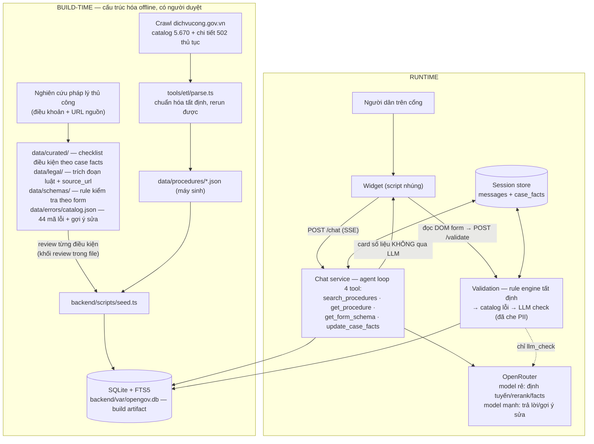

# DESIGN.md — Giải pháp OpenGOV: use case, luồng dữ liệu, quyết định thiết kế

> Spec chi tiết của giải pháp. Đọc [PROBLEM.md](../PROBLEM.md) (đề bài + tiêu chí) và [SOLUTION.md](../SOLUTION.md) (tổng quan 3 trụ cột) trước. Kiến trúc backend chi tiết: [ARCHITECTURE.md](ARCHITECTURE.md). Contract dữ liệu: [DATA.md](DATA.md). Spec widget: [WIDGET.md](WIDGET.md).

## 1. Định vị

OpenGOV giúp người dân nộp hồ sơ hành chính **đúng và đủ ngay lần đầu**. Ba lựa chọn định vị — giữ nguyên, không pha loãng:

1. **Kiểm tra hồ sơ trước khi nộp là năng lực lõi.** Hỏi–đáp thủ tục đã bão hòa (Google, ChatGPT, trợ lý ảo các tỉnh, chatbot VNeID, iHanoi — đều dừng ở Q&A). Không sản phẩm nào trong số đó kiểm tra được *hồ sơ người dân đang điền* theo luật của *từng thủ tục*. Đó là khoảng trống OpenGOV chiếm.
2. **Thủ tục được cấu trúc hóa thành rule/schema máy-đọc-được** (điều kiện theo tình huống, giấy tờ, trường bắt buộc, ràng buộc chéo) — không phải RAG thuần trên văn bản luật. Kiểm tra vì thế tất định, audit được, không ảo giác.
3. **Embed-first**: sản phẩm là widget/API nhúng vào cổng sẵn có ngay từ ngày đầu, không phải app riêng "sẽ tích hợp sau".

## 2. Use case của widget

Người dùng: người dân đang ở trên cổng dịch vụ công (không rành công nghệ, dùng tiếng Việt tự nhiên). Widget là bong bóng chat góc màn hình, mở thành panel hội thoại.

### UC-1 — Guided intake: từ nhu cầu mơ hồ → checklist đúng tình huống
- **Luồng**: người dân gõ nhu cầu đời thường ("tôi muốn chuyển hộ khẩu về nhà vợ") → backend tìm đúng thủ tục (alias + FTS + rerank) → AI hỏi làm rõ tình huống (nhà thuộc sở hữu ai? có sổ đỏ chưa?…) → mỗi câu trả lời được ghi thành **case fact** có cấu trúc → checklist giấy tờ và các bước **lọc theo đúng tình huống đó**, kèm ví dụ.
- **Endpoint**: `POST /chat` (SSE); facts ghi qua tool `update_case_facts`; checklist render từ card `checklist` tất định — backend lọc item theo case_facts, thiếu fact → giữ item kèm badge "tùy trường hợp", widget cho tick từng mục ([WIDGET.md](WIDGET.md) §5.4, §10 R2).
- **UX states**: đang gõ (token stream), thiếu fact → nhóm giấy tờ điều kiện vẫn hiển thị kèm badge "tùy trường hợp" (fail-open cho hiển thị — thà thừa còn hơn thiếu), ngoài phạm vi dữ liệu → nói thẳng + link cổng chính thức (fail-closed cho nội dung).

### UC-2 — Hỏi đáp có trích dẫn
- **Luồng**: câu hỏi về phí, thời hạn, nơi nộp, căn cứ pháp lý → trả lời ngắn bằng lời + **card số liệu render thẳng từ CSDL** (phí, thời hạn xử lý, cơ quan, trích đoạn điều luật kèm nguồn). LLM chỉ chọn card và viết lời dẫn — không tự sinh con số.
- **Endpoint**: `POST /chat`; card types: `procedure`, `fees`, `processing`, `deadlines`, `legal_basis`, `legal_fragments`.
- **UX states**: mọi trích đoạn pháp lý có nút mở `source_url`; câu ngoài KB → thông điệp "không có trong dữ liệu" + link.

### UC-3 — Kiểm tra hồ sơ trước khi nộp (điểm khác biệt chính)
- **Luồng**: người dân đang điền form trên cổng → bấm **"Kiểm tra hồ sơ"** trong widget → widget đọc DOM của **bước form đang mở** (field name `snake_case` trùng khóa schema; thủ tục của trang tự phát hiện bằng DOM-match với `GET /schemas`, nút ẩn/disabled/enabled theo mức phát hiện — contract trong [WIDGET.md](WIDGET.md) §6) → `POST /validate {procedure_code, fields, case_facts}` → danh sách lỗi theo từng trường: thông điệp tiếng Việt + gợi ý sửa, phân mức `error/warning/info`.
- **Hai tầng kiểm tra**: (1) rule engine tất định — 10 loại rule đóng theo [DATA.md](DATA.md) §4; (2) kiểm tra ngữ nghĩa bằng LLM cho free-text (tên doanh nghiệp vi phạm Điều 38, số tiền bằng chữ khớp bằng số) — dữ liệu **che PII trước khi rời máy chủ**, kết quả chỉ được *thêm* lỗi, không bao giờ gỡ lỗi tầng 1.
- **UX states**: 0 lỗi → xác nhận xanh; có lỗi → nhóm theo trường, click cuộn tới field; backend thiếu LLM key → vẫn trả đủ lỗi tất định + ghi chú đã bỏ bước kiểm tra ngữ nghĩa.

### UC-4 — (Pha 2, đã build) Kiểm tra inline trên chính form của cổng
- **Luồng**: cổng tích hợp chủ động bằng web components: `<opengov-field-hint>` gắn cạnh field (hint + lỗi inline khi blur), `<opengov-check-button>` đặt cạnh nút nộp của cổng. Cùng backend `/validate`, khác cách hiển thị: lỗi nằm **ngay trên form**, không trong chat.
- Kèm **thao tác giao diện hộ người dùng** theo ba mức (overlay chỉ dẫn → điền hộ có xác nhận từ case facts → dẫn thao tác từng bước), với nguyên tắc an toàn: thao tác đọc tự động, thao tác ghi phải được người dùng duyệt, không bao giờ tự nộp hồ sơ — chi tiết [SOLUTION.md](../SOLUTION.md) §3.

### UC-5 — Demo "dữ liệu hành chính luôn hiện hành": cải cách 01/07/2025
- **Kịch bản demo đắt giá**: người dân điền địa chỉ dùng tên tỉnh đã sáp nhập ("Hà Giang") hoặc còn cấp huyện ("huyện X") → engine bắt bằng rule `province_not_defunct` / `no_district_level` đối chiếu `data/provinces.json` (34 tỉnh hiện hành + 29 tỉnh giải thể theo NQ 202/2025/QH15) → lỗi kèm gợi ý tên đơn vị mới ("Hà Giang đã hợp nhất vào Tỉnh Tuyên Quang").
- Chứng minh luận điểm: quy định đổi nhanh, chatbot huấn luyện tĩnh sẽ sai — OpenGOV cập nhật bằng **dữ liệu**, không cần huấn luyện lại.

## 3. Luồng dữ liệu end-to-end

Hai bất biến quan trọng nhất của luồng này:

- **Runtime không bao giờ diễn giải văn bản thô.** Mọi chuyển đổi văn bản → cấu trúc xảy ra ở build-time, có người duyệt, commit vào `data/` (mỗi file curated/legal/schema mang khối `review` ghi người duyệt + phương pháp). Sai ở đâu, sửa dữ liệu ở đó — audit được bằng git.
- **Số không đi qua LLM.** Phí, thời hạn, cơ quan, trích dẫn đọc từ CSDL vào card; backend còn chặn prose chứa số liệu không nằm trong card đi kèm.

## 4. Ba pha tích hợp — lịch sử git là bằng chứng

| Pha | Cổng phải làm gì | Nhận được gì |
|---|---|---|
| **1 — Script embed** (~1 giờ công) | Thêm **một thẻ `<script>`** | Bong bóng chat: intake, hỏi đáp trích dẫn, kiểm tra hồ sơ đọc từ DOM — kết quả trong cửa sổ chat (UC-1/2/3/5) |
| **2 — API + components** (tích hợp chủ động, nhỏ và khoanh vùng) | Gắn web components vào trang form + mapping field→schema | Lỗi inline trên chính form, nút kiểm tra cạnh nút nộp, prefill từ hội thoại (UC-4) |
| **3 — Insights** (lộ trình, ngoài demo) | Không | Thống kê câu hỏi/lỗi phổ biến cho đơn vị vận hành cổng cải thiện biểu mẫu gốc |

Cách chứng minh tính khả thi không phải bằng lời hứa mà bằng **lịch sử commit**: bản clone cổng DVC (`dichvucong/`) được dựng **hoàn toàn độc lập, không một tham chiếu nào tới widget**; commit tích hợp Pha 1 vì thế sẽ là **diff đúng một dòng** — đó chính là chi phí thật mà một cổng hiện hữu phải bỏ ra. Pha 2 nằm ở các commit tiếp theo, nhỏ và đo đếm được. (Trạng thái các commit này: xem [PLAN.md](../PLAN.md).)

## 5. Ba tầng xử lý

1. **Client (JS thuần trong widget)**: bắt DOM form, các rule rẻ chạy được tại chỗ; không gọi model.
2. **Tầng SLM chủ quyền (lộ trình)**: che/tách PII, map field→schema, định tuyến ý định — chạy self-hosted để **PII không bao giờ rời hạ tầng ở dạng thô**. Trong demo, tầng này được stub bằng LLM API **sau cùng một interface** — tráo được khi triển khai thật, không đổi kiến trúc.
3. **LLM API (OpenRouter)**: kiến thức thủ tục grounding trên KB có cấu trúc + trích dẫn; sinh gợi ý sửa từ dữ liệu đã che.

## 6. Quyết định thiết kế chính & trade-off

| Quyết định | Thay vì | Được gì / chấp nhận gì |
|---|---|---|
| **Bộ rule đóng 10 loại** (khai báo JSON, engine tất định) | RAG/LLM tự do phán hồ sơ | Kiểm tra đúng tuyệt đối theo schema, test được, không ảo giác. Đổi lại: điều kiện nào không biểu diễn được bằng 10 rule thì đẩy sang tầng advisory (chat nhắc) chứ không cho vào engine |
| **Số liệu render từ DB qua card, LLM chỉ viết lời dẫn** | Để LLM trả lời trọn gói | Không thể bịa phí/thời hạn — tiêu chí chính xác là tiêu chí số 1. Đổi lại: câu trả lời đôi khi "cứng" hơn văn tự do |
| **Chat fail-closed, hiển thị checklist fail-open** | Một chính sách chung | Nội dung không có trong KB thì từ chối + link cổng thật (không đoán); riêng checklist khi thiếu case fact thì hiển thị thừa kèm badge "tùy trường hợp" (thiếu giấy tờ đắt hơn thừa) |
| **Toàn bộ KB commit trong `data/`, SQLite build lại từ data khi deploy** | CSDL quản lý riêng / vector DB | Nguồn sự thật đi theo git (diff/review/rollback từng điều kiện); không cần hạ tầng DB; không phụ thuộc embeddings. Đổi lại: dữ liệu lớn hơn 502 thủ tục cần pipeline hóa (đã có sẵn thiết kế trong [ARCHITECTURE.md](ARCHITECTURE.md)) |
| **Grounding cả bản ghi thủ tục, không chunk-RAG** | Vector search từng đoạn | Mỗi thủ tục chỉ vài nghìn token — nạp trọn, hết lỗi "trả lời thiếu ý vì retrieval sót". Retrieval chỉ dùng để *tìm đúng thủ tục* (alias + FTS5 + rerank) |
| **Cấu trúc hóa offline có người duyệt** | Parse tự động khi chạy | Mỗi `when`/điều kiện có người chịu trách nhiệm (khối `review`); tốc độ đổi bằng độ tin — chấp nhận công curation cho pilot, đã có đường scale bán tự động |
| **OPENROUTER_API_KEY tùy chọn, degrade có chủ đích** | Bắt buộc key mới chạy | Demo/CI chạy không cần secret: `/validate` vẫn đủ rule tất định, `/chat` degrade + link cổng. Đổi lại: thiếu key thì không demo được ngữ nghĩa |
| **Clone cổng DVC dựng blind rồi mới tích hợp** | Dựng demo có sẵn widget | Câu chuyện tích hợp có bằng chứng git (diff 1 dòng); clone còn là môi trường demo trung thực (giao diện người dân quen). Đổi lại: tốn công dựng clone |
| **Checklist là card tất định, không phải prose LLM** | Để LLM tự viết danh sách giấy tờ | Số lượng bản chính/bản sao + điều kiện lọc đến từ dữ liệu đã duyệt, tick được, không dính guard số liệu. Đổi lại: thêm card type thứ 7 phía backend (build từ curated) |
| **Widget tự phát hiện thủ tục bằng DOM-match qua `GET /schemas`** | Cấu hình map slug→mã trong thẻ embed | Embed zero-config — giữ đúng lời hứa tích hợp 1 dòng; portal-agnostic. Đổi lại: thêm 1 endpoint read-only |
| **Khôi phục hội thoại bằng cache transcript phía client** | Persist cards/kết quả check vào DB server | Khôi phục đầy đủ (cards, tick, kết quả check) sau điều hướng mà không đổi schema DB; sessionStorage per-tab vốn không có ca đa thiết bị. Đổi lại: transcript hiển thị sống ở client, server chỉ giữ text làm ngữ cảnh chat |
| **Model chọn card qua tail máy-đọc `[[CARDS:]]` cuối answer, backend parse + strip** | Tool `select_cards` riêng / heuristic keyword phía service / emit đủ 6 card như trước | Mỗi lượt chỉ hiện thẻ liên quan câu hỏi (hết "tường card"); không tốn iteration của agent loop; không có điểm hụt khi model quên gọi tool (fail-safe: `procedure`+`legal_fragments` + warning); test script được. Đổi lại: thêm bước parse; phụ thuộc model tuân thủ format tail (fail-safe đỡ) |
| **LLM nhận bản ghi projection (bỏ steps_raw/review, rút gọn tên văn bản; giữ checklist_raw), card đọc record đầy đủ** | Dump nguyên record 30–40KB vào context | Bớt nguyên liệu khiến model kể lể; rẻ và nhanh hơn; số liệu card không suy giảm (đọc từ record full trong `visited`); giữ checklist_raw vì chi tiết giấy tờ theo trường hợp chỉ có ở đó. Đổi lại: thêm module projection phải giữ đồng bộ khi record thêm field quan trọng |
| **Ngân sách trả lời: prompt là kiểm soát chính (~120 từ), `maxTokens: 1200` làm lưới an toàn + tắt reasoning (`reasoning: {effort:"none"}`)** | Không giới hạn (hiện trạng) / chỉ maxTokens / để reasoning bật | Trả lời vừa một màn panel 380px, không đứt giữa câu; người dùng lowtech không bị tường chữ. Trần 700 ban đầu bị deepseek-v4-pro (reasoning model — token suy nghĩ tính vào max_tokens) cắt cụt giữa từ và nuốt luôn dòng `[[CARDS:]]` → cả 3 model trong chain đều tắt reasoning, trần nâng lên 1200, client log cảnh báo khi `finish_reason=length`. Đổi lại: câu hỏi thật sự cần chi tiết phải hỏi thêm lượt nữa (chủ đích — hội thoại từng bước); mất chất lượng reasoning (chấp nhận — task tra cứu + trích dẫn, không phải suy luận nhiều bước) |
| **Card lặp giữa các lượt: dedup khi render ở widget, wire giữ nguyên** | Backend ngừng force-include procedure card ở lượt nối tiếp / dedup theo cả phiên | Mỗi answer trên wire vẫn tự chứa (golden-qa assert `procedure_code` từng lượt, restore từng turn đủ card); widget bỏ qua card giống hệt (so JSON) card ở lượt assistant gần nhất phía trước — procedure card force-include không còn lặp, nhưng hỏi lại sau một quãng (lượt lỗi / fail-closed xen giữa) thì card hiện lại. Checklist lọc lại theo case_facts mới có payload khác → vẫn render |
| **Demo grounding: prompt biết mình chạy trên cổng demo + `form_path` tương đối trên card (env `OPENGOV_FORM_PATH_PREFIX` + `form_ref`)** | Hardcode URL Vercel vào prompt/card / giữ nguyên chỉ về dichvucong.gov.vn | 3 pilot được hướng dẫn nộp tại chỗ (CTA vào wizard của chính cổng đang nhúng — đúng embed-first, đổi cổng không đổi data); `PORTAL_URL` giữ vai trò trích nguồn + fail-closed cho thủ tục ngoài phạm vi. Đổi lại: đường dẫn tương đối chỉ có nghĩa khi widget nhúng trên chính cổng (trang test trắng click 404 — chấp nhận) |
| **Ba directive tail hợp nhất `[[CARDS/CHIPS/GUIDE:]]`, parser strip mọi dòng `[[KEY:]]`** | Tool call riêng cho chips/guide / event schema mới ngoài tail | Một cơ chế duy nhất model đã tuân thủ tốt (CARDS), không tốn iteration agent loop, KEY lạ strip im lặng nên thêm directive sau không vỡ widget cũ; chips/guide là progressive enhancement (thiếu → không sao). Đổi lại: tail vẫn là điểm yếu khi truncation (đã mitigate: reasoning off + trần 1200 + log finish_reason) |
| **Guide/spotlight kích hoạt bằng nút bấm trong chat, không auto** | Auto-spotlight khi answer hiện | Người dùng chủ động, không giật màn hình, không phải chặn phát lại khi restore transcript; nguyên tắc "đọc tự động" vẫn giữ (spotlight là read-only). Đổi lại: demo phải bấm thêm 1 nút |
| **Prefill ghi qua native setter + preview tick từng dòng + turn `prefill` trong transcript + hoàn tác** | Ghi thẳng `.value` / tự điền không hỏi | Hoạt động với React controlled inputs của cổng; mọi thao tác ghi có duyệt, có log, có undo (nguyên tắc an toàn trụ 3); nguồn hiển thị là tên fact (không trích câu gốc — backend không track provenance fact→message, roadmap). Đổi lại: inline style viền accent đụng host có kiểm soát (track + gỡ khi hoàn tác) |
| **Prefill khi session trống: nút "Điền giúp tôi" gửi hộ tin nhắn nhờ trợ lý thu thập, model hỏi từng câu một (prompt rule 13) + backend tiêm case_facts đã ghi vào mỗi lượt (system note) + guard tất định "ghi nhận" (lượt nói ghi nhận mà không gọi update_case_facts → một lượt sửa sai ép gọi)** | Thông báo "chưa có thông tin" rồi dừng (bản đầu) / hỏi gộp mọi mục trong một lượt / model tự nhớ facts qua history / tin prompt là đủ | Nút không bao giờ là ngõ cụt — bấm là vào luồng thu thập; hỏi từng câu hợp người lowtech (một việc mỗi lượt, chips bấm được); system note cần thiết vì history chỉ lưu text nên model không thấy facts đã ghi → sẽ hỏi trùng; guard cần thiết vì thử live deepseek 2 lần nói "đã ghi nhận" nhưng không gọi công cụ — fact mất im lặng, prompt siết mấy cũng không chắc. Đổi lại: thu thập tốn nhiều lượt LLM hơn + lượt sửa sai tốn thêm một call khi guard nổ (chấp nhận — rẻ, đúng quan trọng hơn) |
| **Fact string → field `select`: resolver khớp option (bỏ dấu/hoa-thường, word-boundary containment duy nhất), mơ hồ thì bỏ dòng; `writeField` xác nhận select thực nhận giá trị** | Ghi thẳng giá trị fact vào select / bắt model xuất đúng option | Giá trị hội thoại là lời tự nhiên ("con đẻ") còn select chỉ nhận option đúng ("Con") — ghi thẳng là fail im lặng; resolver tất định phía widget chịu được cả token snake_case model lỡ sinh. Đổi lại: khớp mơ hồ (["Cha","Mẹ"] với "cha mẹ") bị bỏ qua — người dùng tự chọn tay (an toàn hơn đoán sai) |
| **Intake phân nhánh cá nhân/doanh nghiệp ở màn chào: client-only (chip phân loại chỉ đổi state cục bộ, không gọi LLM), nhánh tự suy từ `procedure_code` trang đang detect qua map tường minh** | Tune prompt để model tự hỏi phân loại qua `[[CHIPS:]]` / gửi segment lên backend | Hai nhóm người dùng có nhu cầu khác hẳn nhau thấy ngay việc của mình; phân loại tức thì, deterministic, 0 lượt LLM, 0 thay đổi backend; chip kịch bản tự chứa ngữ cảnh nên LLM không cần biết segment. Đổi lại: segment không đến được model (nếu sau này cần cá nhân hóa câu trả lời theo segment thì phải thêm kênh, ví dụ system note) và không persist qua reload khi transcript còn rỗng |

## 7. Non-goals

- Không đề xuất thiết kế lại cổng — clone tồn tại để chứng minh tích hợp, không phải để khoe UI riêng.
- Không làm app mobile/desktop độc lập.
- Không mở rộng ngoài 3 thủ tục pilot trong demo (mở rộng = thêm dữ liệu, đã chứng minh bằng kiến trúc).
- Không tự động crawl-cập nhật theo lịch trong demo (roadmap; hiện hiển thị ngày cập nhật dữ liệu trên card).
